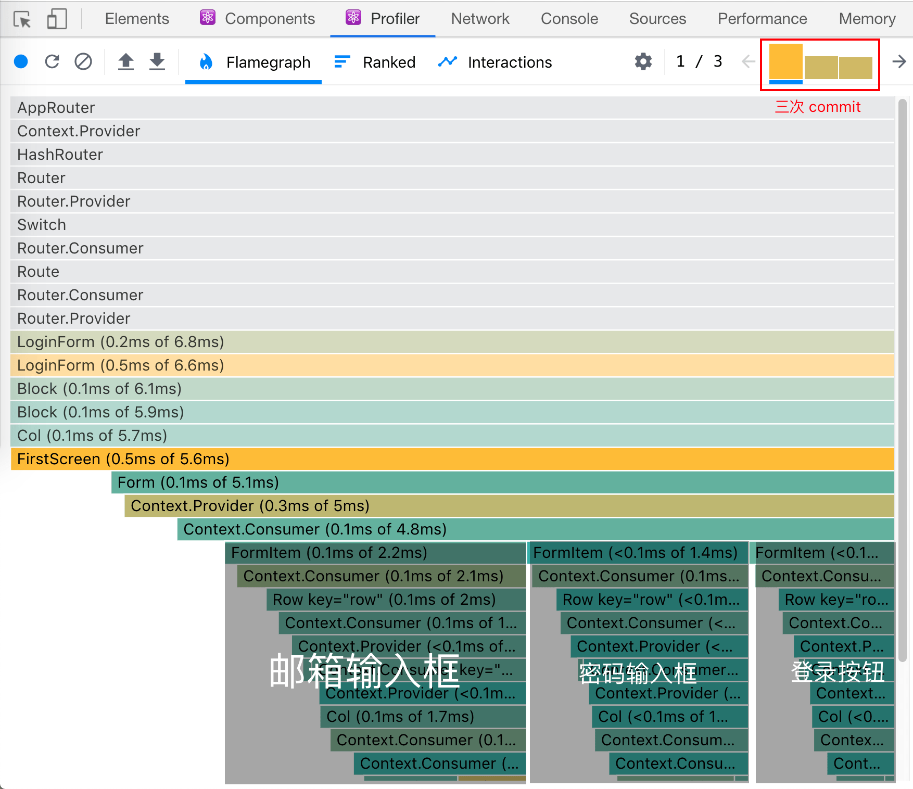
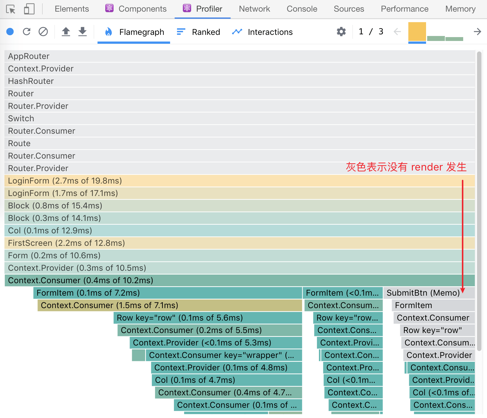

一个 React.js 制作的登录页，UI 长这样：


从上图我们可以看到，表单有三个元件：

1. 邮箱输入框
2. 密码输入框
3. 登录按钮

我们试试用 [react-devtools](https://github.com/facebook/react-devtools) 监测一下，在邮箱输入框输入 “123” 时会发生什么：



React 的工作，大致有[两个阶段](https://reactjs.org/blog/2018/09/10/introducing-the-react-profiler.html#reading-performance-data)：

1. `render` 阶段，生成 Virtual DOM，然后 diff；
2. `commit` 阶段，根据 `render` 阶段 diff 的结果来更新 DOM 节点。

截图中一共有三条柱形，表示我们的操作过程中 React 统计到三次 commit - 黑色表示当前选中了第一个 commit。这里柱形的高度表示 `render` 阶段的耗时，注意，我们并不统计 commit 阶段的耗时，因为 commit 阶段是浏览器引擎的工作，并没有我们优化的余地。

理论上，我们操作邮箱输入框，登录按钮是没有必要反复 render 的。但截图里我们看到了，登录按钮随之发生 render，这是因为，组件是否重新 render 由 [`shouldComponentUpdate`](https://reactjs.org/docs/react-component.html#shouldcomponentupdate) 决定，而它的返回值默认是 `true`。这就浪费时间了，也因此这里就有了优化的余地：我们可以抽出登录按钮代码，变成一个组件，然后在组件的 `shouldComponentUpdate` 事件中返回 `false`，阻止多余的 render。

因为这个优化非常常见，所以 React 特地提供了 [`React.PureComponent`](https://reactjs.org/docs/react-api.html#reactpurecomponent) 与 [`React.memo`](https://reactjs.org/docs/react-api.html#reactmemo)，分别针对类组件与函数组件 ：

```javascript
// 两个版本，喜欢哪个用哪个

// PureComponent 版本
import React from 'react'
export default class SubmitBtn extends React.PureComponent {
  render () {
    return ...
  }
}
// React.memo 版本
function SubmitBtn() {
  return ...
}
export default React.memo(SubmitBtn)
```

优化后的监测结果：



这一次，我们操作邮箱输入框时，登录按钮不再 render。

由此我们就探索出一条 React 性能优化的道路，即**拆分组件**，将组件拆到可以用 memo 或 PureComponent 避开多余的 render - 就达到优化的目的。