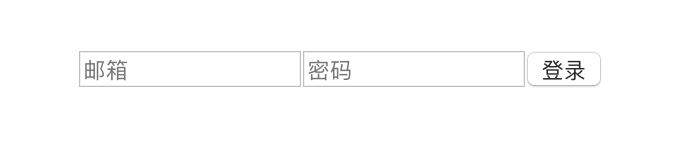
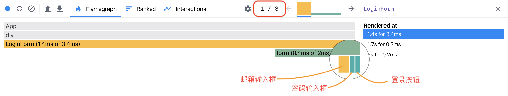
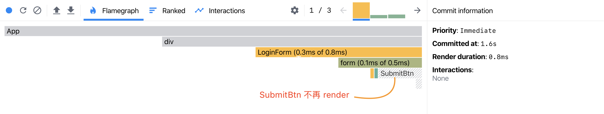

一个 React.js 制作的登录组件，UI 很粗糙，如下图所示：



表单代码也很清爽：

```js
class LoginForm extends React.Component {
  state = {
    email: '',
    password: ''
  };
  changeEmail = e => {
    this.setState({
      email: e.target.value
    });
  };
  changePassword = e => {
    this.setState({
      password: e.target.value
    });
  };
  submit = () => {};
  render() {
    return (
      <form onSubmit={this.submit}>
        <input
          type="text"
          placeholder="邮箱"
          value={this.state.email}
          onChange={this.changeEmail}
        />
        <input
          type="password"
          placeholder="密码"
          value={this.state.password}
          onChange={this.changePassword}
        />
        <button type="submit">登录</button>
      </form>
    );
  }
}
```

从代码中我们可以看到，该登录表单有三个元件：

1. 邮箱输入框
2. 密码输入框
3. 登录按钮

试试用 [react-devtools](https://reactjs.org/blog/2019/08/15/new-react-devtools.html) 监测一下，在邮箱输入框输入 “123” 时会发生什么。

监测结果如下图所示：



React 的工作，大致有[两个阶段](https://reactjs.org/blog/2018/09/10/introducing-the-react-profiler.html#reading-performance-data)：

1. `render` 阶段：state 或 props 变化后，根据 class 组件的 `render` 方法（或 function 组件的 `return` 语句）生成 Virtual DOM，然后 diff 新旧两份 Virtual DOM；
2. `commit` 阶段：根据前一阶段 diff 的结果来操作 DOM 节点。

截图中我们看到右上角有三条柱形，表示 React 开发者工具统计到三次 commit - 图中正在查看第一个 commit。

理论上，我们操作邮箱输入框，登录按钮是没有必要反复 render 的。但截图里我们看到，邮箱输入框中输入时，登录按钮随之发生 render。这是因为 React 下，组件是否重新 render 由 [`shouldComponentUpdate`](https://reactjs.org/docs/react-component.html#shouldcomponentupdate) 决定，而它的返回值默认是 `true`，不巧登录表单中的三个元件全部定义在 `LoginForm` 的 `render` 方法中，因此悉数进入 `render` 阶段。

这就浪费时间了，也因此这里就有了优化的余地，我们可以将登录按钮拆成一个组件：

```js
export default class SubmitBtn extends React.Component {
  render() {
    return; // ...
  }
}
```

并在 `SubmitBtn` 组件中定义一个返回 `false` 的 `shouldComponentUpdate` 函数，阻止多余的 render：

```js
export default class SubmitBtn extends React.Component {
  shouldComponentUpdate() {
    return false;
  }
  render() {
    return; // ...
  }
}
```

优化后的监测结果：



这一次，我们操作邮箱输入框时，登录按钮组件不再 render。

以小见大，我们就探索出一条 React 性能优化的道路：**拆分组件**，将组件拆到可以通过 `shouldComponentUpdate` 避免多余 render - 就达到性能优化的目的。

因为这个优化非常常见，所以 React 特地提供 [`React.PureComponent`](https://reactjs.org/docs/react-api.html#reactpurecomponent) 与 [`React.memo`](https://reactjs.org/docs/react-api.html#reactmemo)，分别针对类组件与函数组件 ：

```js
// 两个版本

// PureComponent 版本
import React from 'react'
export default class SubmitBtn extends React.PureComponent {
  render () {
    return ...
  }
}
// React.memo 版本
function SubmitBtn() {
  return ...
}
export default React.memo(SubmitBtn)
```
