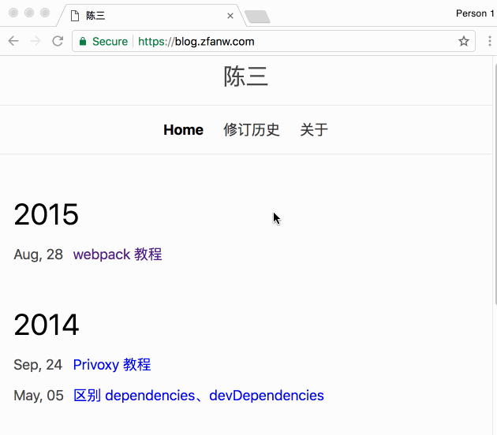

显然，前端开发并不活在真空。很多时候，需要我们关心 SEO（搜索引擎优化）。有众多第三方网站、工具提供免费或收费的 SEO 审计功能，但现在，打开 Chrome 65 就有 - 来自 Google 官方的、免费的 SEO 审计。

用法如下：

1. 打开 Chrome 开发者工具，
2. 选择 **Audit** 选项卡，
3. 点击 **Perform an audit...**，
4. 勾选 **SEO**，并点击 Run audit，
5. 等待结果。

当然，目前审计的内容还比较基础，后期有望扩增更多功能。

Via [Launching SEO Audit category in Lighthouse Chrome extension ](https://webmasters.googleblog.com/2018/02/seo-audit-category-in-lighthouse.html)

