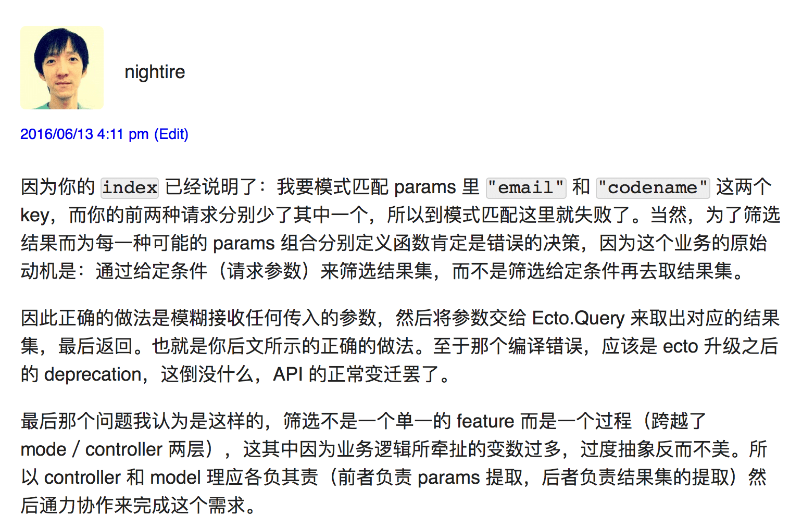
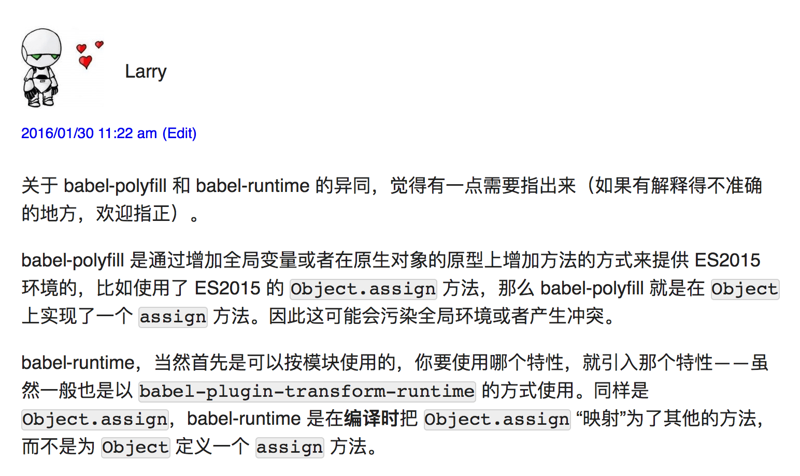

说说我决定从 WordPress 迁移到 Hugo 的原因：

1. 现在的[静态内容生成工具很多](https://www.staticgen.com/)，易用性不输 WordPress；另外近几年前端开发变化很大，像 AutoPrefixer 这样的工具，要集成到 WordPress 很难
2. PHP 太脆弱，如果我在线修改 WordPress 的主题，很可能整个站点都要挂掉，最后只能 ssh 到 VPS 上直接改源文件 - 是的，其实是我的错，因为我没有搭建本地开发环境
3. 最重要的，WordPress 的评论系统没什么用处。我曾经关过评论 - 因为垃圾评论太多。而今我后台里 200 多条评论，大约找得出两条值得迁移的：

当然，WordPress 也有擅长的，比如 4.4 里推出的[响应式图片](https://make.wordpress.org/core/2015/11/10/responsive-images-in-wordpress-4-4/)，目前在静态博客生成工具下我还不知道如何摆弄。

至于为什么用基于 golang 搭建的 Hugo，而不是用 Hexo 这些基于 Node.js 搭建的，就纯属巧合。

迁移时，我用了 [wordpress to hugo exporter 插件](https://github.com/SchumacherFM/wordpress-to-hugo-exporter)，效果不错，但还不完美，还有不少需要我手动处理的地方。
