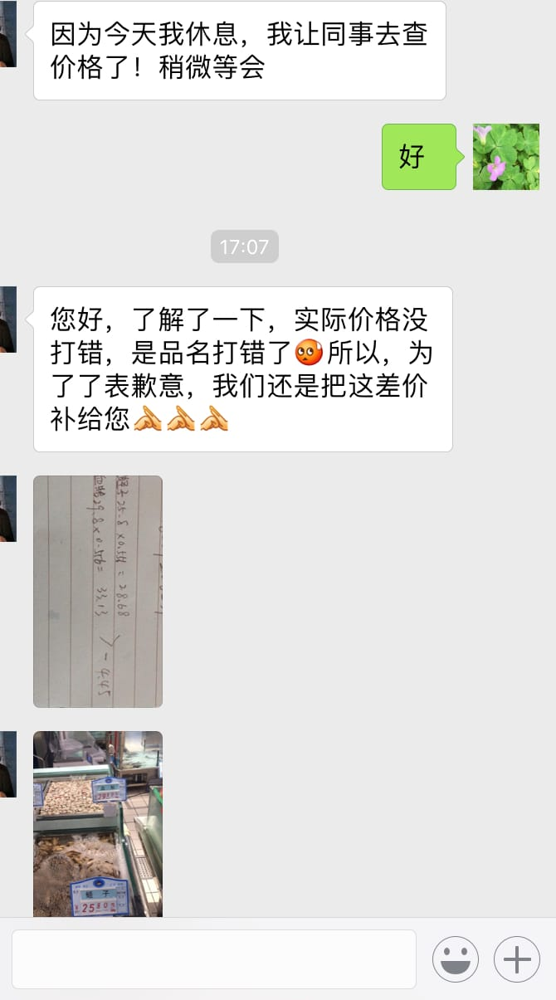
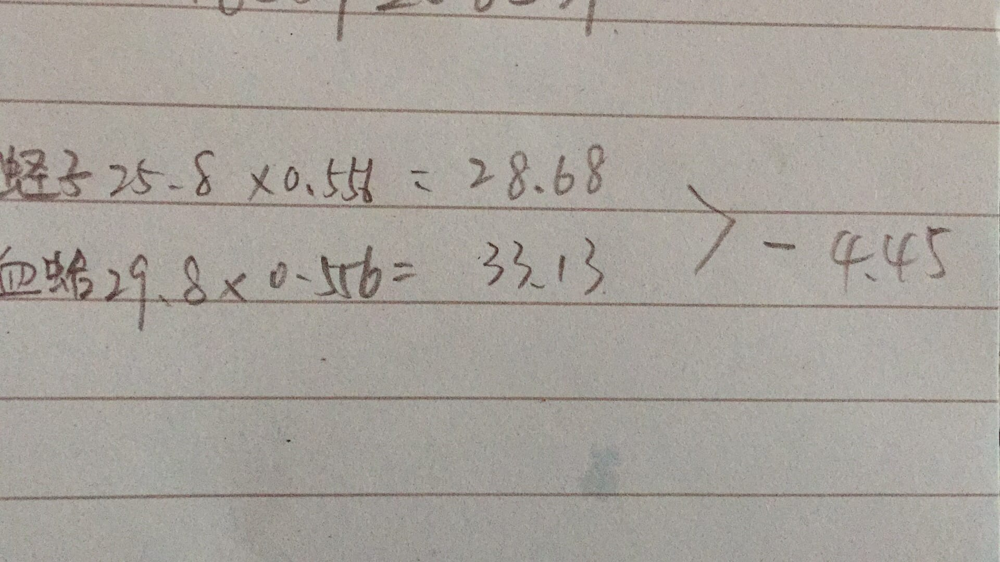
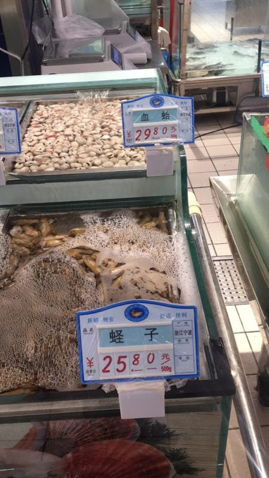
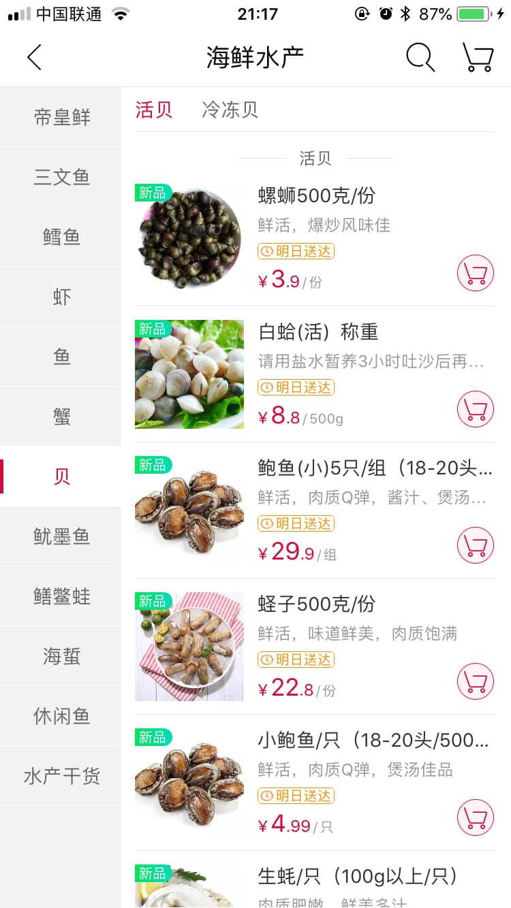
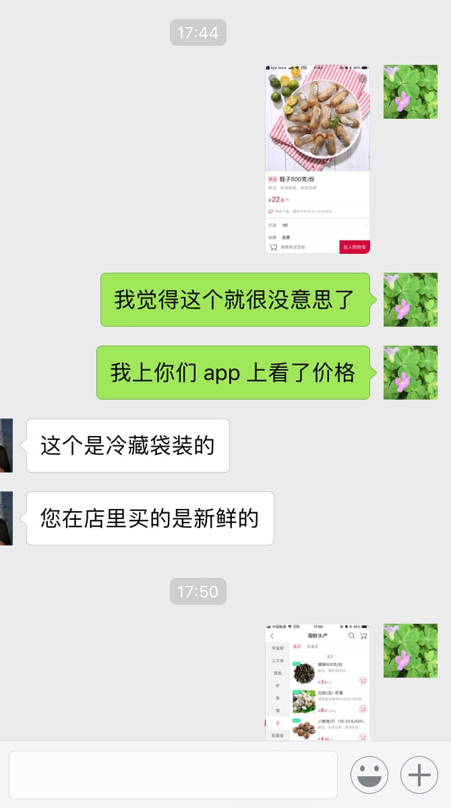
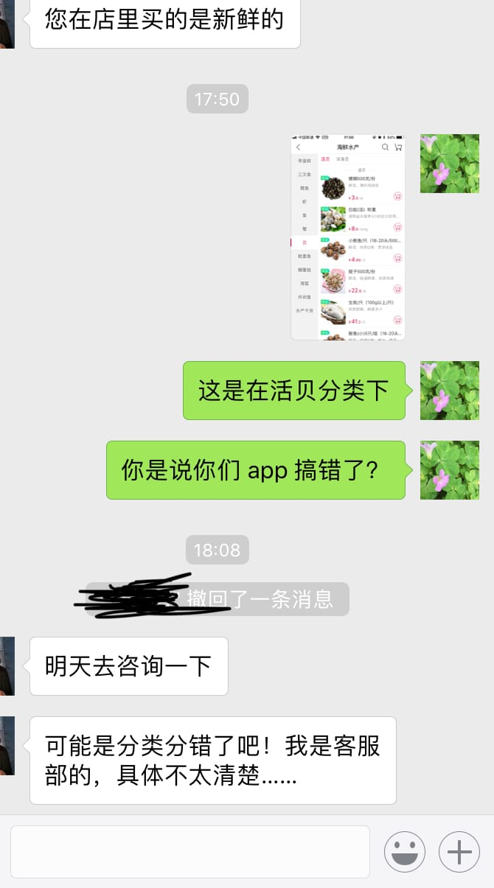
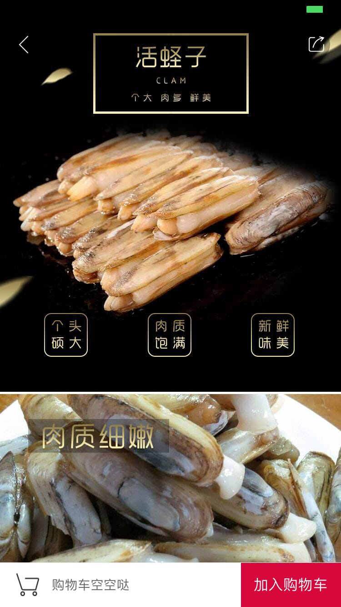
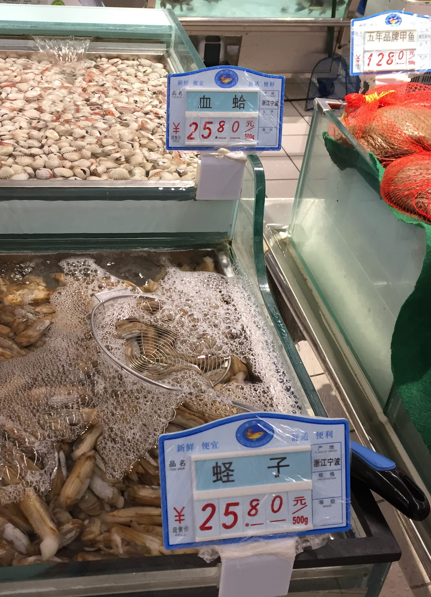
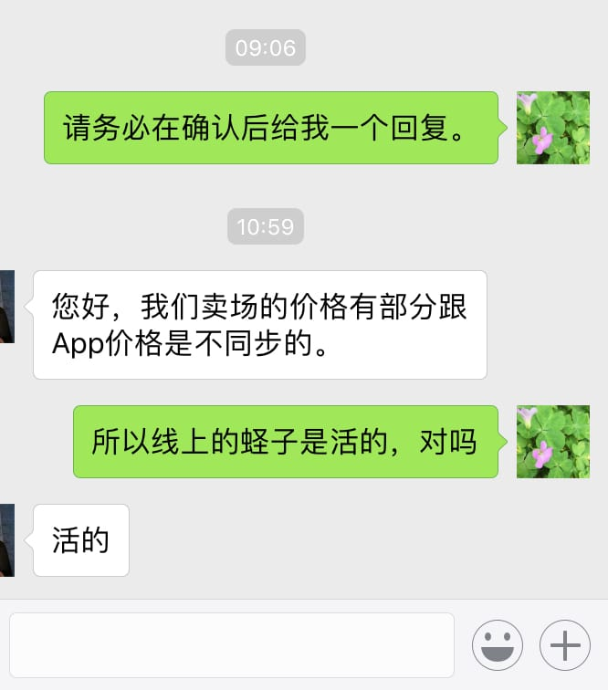

听说最近蛏子肥美，正是上桌的好季节，于是几天前（2018.04.14 16:43），我从大润发买了 556g 蛏子，准备做葱油蛏子。到家后发现蛏子标签错了，打成血蛤。于是我联系大润发售后，想让对方确认蛏子价格（很可惜，我没有确认到价格，否则后面会少了很多事），多退少补。但该售后人员一味坚持，**我得带上蛏子到现场才有办法给我处理**。

我不乐意，因为再跑一趟，显然是浪费我时间，这对我造成二次损害。何况我当晚就打算吃掉蛏子的，绝无可能留到几天后再带去现场。

沟通无果后，我只好结束电话，当天傍晚（17:28）向 12315 投诉大润发。我提的诉求是，我给大润发通过线上途径发照片验证，多退少补也通过线上进行，我不愿意人到现场 - 除非他们愿意对二次损害进行补偿。

今天上午（2018.04.16 08:29）我收到短信，说我反映的事项已经由信访局受理。下午（15:01），收到工商局电话，再次与我确认我的诉求，结束电话前，工作人员告诉我他会去联系大润发。

今天下午（16:28），一个手机号码打来，称自己是大润发客服，态度十分诚恳，说大致了解了我的诉求，能够、也愿意通过线上处理，让我加她微信：

她发给我的俩张图是这样：

当时我就收下了 4.5 元的红包，准备原谅他们。

随后我想起大润发有 App，就安装一个，查看蛏子价格：

这显然与客服发给我的价格不一样。为了确认，我就发截图给对方：

对方称这是冷藏袋装的，我强调那是在**活贝**分类。

事实上，我后来点进去详情，页面写的是“活蛏子”：

这就有两种可能：

1. 大润发线上与线下蛏子售价不一样
2. 大润发员工对售价造假，欺骗我

看来我只有到现场才能离真相近一点。

于是我出门打车去了一趟大润发，这次我买了 300g 的蛏子，顺便我还拍了照片：

**显然，我拍的这张图片与对方发给我的照片并不是同一天所拍的：我拍的照片中血蛤价格是 25.8，而对方让同事拍来的照片里血蛤价格是 29.8**。

但蛏子的价格确实是一样的，我只觉得挫败，仿佛自己刻舟求剑，竟意外成功。

## 更新

2018.04.17 早上，我联系大润发优鲜 app 上提供的 4009206565 电话，询问是否可能出现线上价格与实体店不一样的可能 - 客服称确实可能。也就是说，蛏子这件商品，我可以在线上下单，门店送货上门 - 比我跑去门店直接购买要便宜 25.8 - 22.8 = 3 块钱/斤。

随后门店客服也与我确认，部分商品线上与线下价格不同步：

至此，这件事情就算告一段落。我耗费大量时间跟踪、处理这事，但我不知道，我离真相是远了，还是近了。

不过有一点很清楚，就是我以后不会去大润发消费了。