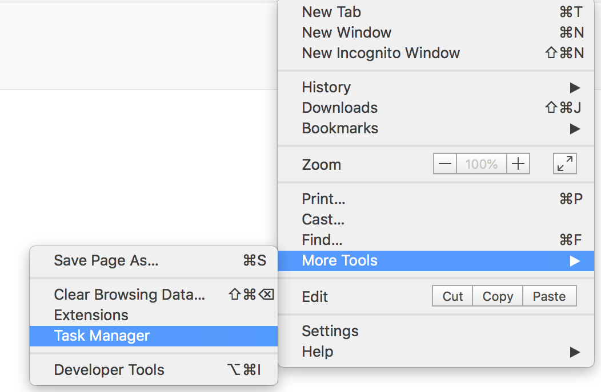
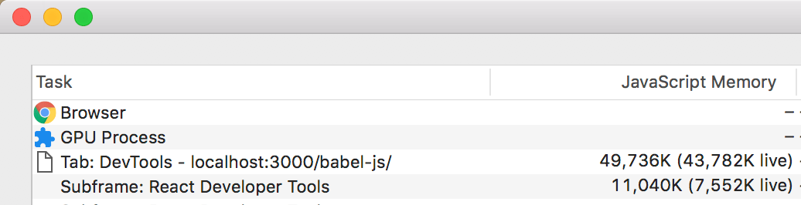
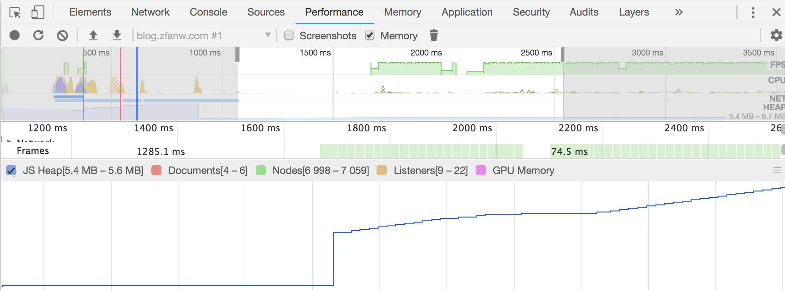

> JavaScript 内存分析是个很大的话题，这里介绍些我的入门经验

如果你在开发 JavaScript 应用时发现页面有明显的卡顿、甚至崩溃的状况，那么很可能内存泄露了。

要怎么调查内存泄露的问题？从哪里开始？怎样的一个步骤？

## Chrome Task Manager

Chrome 内置了 Task Manager，类似 Windows 的任务管理器，打开方式见下图（截图中 Chrome 版本号为 68.0.3440.75）：

打开 Chrome 的 Task Manager 后，我们能看到当前打开的各个标签页的 JavaScript 内存用量：

截图中 `JavaScript Memory` 一列有两个值，我们主要关心括号中的 live 数据 - 如果这个数值在增加，则表示可能有新对象创建了，又或者旧对象在增长。

## Chrome 开发者工具

当然，一边操作页面，一边盯着 Chrome Task Manager 人肉监控内存变化这事实在太落后了。

我们有更好的办法。

我们利用 Chrome 开发者工具的 Performance 面板来监控 Memory 变化：

1.  打开 Chrome 开发者工具
2.  点击 Performance 面板
3.  勾选 Memory 选项
4.  点击 `Collect garbage` 按钮回收内存
5.  点击录制按钮
6.  执行可疑操作
7.  点击 `Collect garbage` 按钮回收内存
8.  再次点击录制按钮，结束录制

上面操作中，我们有两次点击 `Collect garbage`，这是为了排除可回收内存的影响。

## 内存分析

通过 Performance 面板，我们能够监控到内存变化的趋势，但具体是哪些代码引起的内存问题？则需要进一步  借助 Chrome 开发者工具 Memory 面板下的两个内存分析助手：

- Heap Snapshot
- Allocation instrumentation on timeline

Heap Snapshot 能够捕捉当前页面当下 JavaScript 及 DOM 节点的内存使用情况。比如我们想看看当前页面上是否有众多的 Detached DOM 存在，则可以捕捉一个快照，然后搜索 Detached DOM。

当然，我们也可以创建多个快照，然后进行比对，看看哪些操作引发数据的增减，方便我们定位问题所在。

Allocation instrumentation on timeline 可以纪录开启时段中内存分配与回收的情况。比如我们有一个操作，创建了大量的对象，则时间线上就会出现一个蓝条，框选蓝条，我们就能看到具体的内存分配状况。

## 扩展阅读

1.  [Fix Memory Problems](https://developers.google.com/web/tools/chrome-devtools/memory-problems/)
2. [视频：The Breakpoint Ep. 8: Memory Profiling with Chrome DevTools](https://www.youtube.com/watch?v=L3ugr9BJqIs)