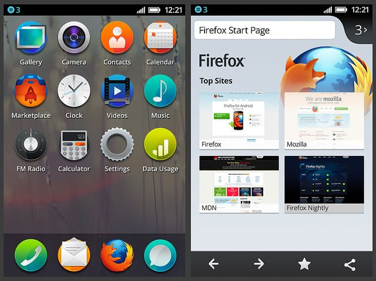

> 本文译自 [There is something magical about firefox OS](http://rawkes.com/articles/there-is-something-magical-about-firefox-os)

过去的一年半时间里，我投入了越来越多的时间在 Mozilla 最新项目 Firefox OS 上。也就在那段时间里，我爱上这个项目，以及它所主张的。这种体验我以前从未体验。

让我说得再明白点：Firefox OS 只是冰山一角。它是一个即将发生的革命。它让人耳目一新。它是前沿科技的巅峰。它是神奇的，它将改变一切。

## Firefox OS 是什么

对不清楚我在讲什么的人们，我快速介绍一下：

> Firefox OS 是一个 Mozilla Boot to Gecko (B2G) 项目开发的新一代手机操作系统。它使用 Linux 内核，并启动基于 Gecko 的运行时引擎，该引擎允许用户运行完全基于 HTML，JavaScript 及其他开放的 Web 应用 APIs 开发的程序。
>
> —[Mozilla Developer Network](https://developer.mozilla.org/en-US/docs/Mozilla/Firefox_OS)

简单说，Firefox OS 运用了 Web 背后的技术，比如 JavaScript 来开发一个完整的手机操作系统。花点时间消化一下 – 它是个由 JavaScipt 驱动的手机系统！

为此，一个稍微定制过的 Gecko (Firefox 背后的引擎) 被开发出来，引入[新的 JavScript APIs](https://wiki.mozilla.org/WebAPI#APIs)，以创造接近手机的体验。这包括 WebTelephony，用于拨打电话；WebSMS，用于发送信息；以及振动 API，显然，用于振动。

<iframe width="560" height="315" src="https://www.youtube.com/embed/5MzuGWFIfio" frameborder="0" allow="autoplay; encrypted-media" allowfullscreen></iframe>

但是 Firefox OS 又不仅仅只是一些前端科技的疯狂应用，它同时也将 Mozilla 的其他项目统一到一个到作为平台的 Web。这些其他项目包括我们的 [Open Web Aps initiative](https://developer.mozilla.org/en-US/docs/Apps) 及确认身份及登入 Web 的 [Persona](https://developer.mozilla.org/en-US/docs/Archive/Mozilla/Persona)，早期称为 BrowserID。能看到 Mozilla 的这许多不同项目统一到一个平台下绝对是让人着迷的。

更多细节在这儿我就略过不说，毕竟这一篇并非要解释该项目的详细内容，不过更多细节可以在 MDN 的 [Firefox OS 页面](https://developer.mozilla.org/en-US/docs/Mozilla/Firefox_OS)找到。我强烈建议大家阅读它们。

## 为什么要 Firefox OS

你可能在想，“这听起来不错，可为什么要用 JavaScript 来开发手机呢？“你是对的，这是个非常重要的问题。幸运的是，我们已经有许多答案来解释为什么这是个好主意。

两个主要的原因是，Firefox OS 填补了移动市场上的空白，另外它给当前的专利保护、限制性的手机环境提供另一种选择。

### 填补移动市场上的空白

对很多人来说，智能手机多数出奇地贵，哪怕是在那些被认为高收入水平的地区，人们也不觉得它们便宜。但如果你认为它们只是在那些有足够可支配收入支付它们的国家显贵的话，则请想一下，16GB 的 iPhone 4S 在发展中国家如巴西要价相当于 615 英磅，这要比同样的手机在英国的价格贵出 100 英磅。

在巴西，这些飞涨的价格主要是因为高额进口税。苹果公司显然正在通过在该国建立本地生产线来避免这些，但不管怎么说，这都说明一个重要的问题，就是高端设备在全球所有地区并不总是个可选项。更不用说，在某些如[巴西这种犯罪率奇高的国家](http://en.wikipedia.org/wiki/Crime_in_Brazil)，你手里挥舞的一台手机价格相当于一辆小型汽车时会发生什么。

那么，如果你想拥有一部智能手机，又不想支付一大笔钱时该怎样？你可以买台便宜的 Android 手机，不过它们多数表现糟糕。

幸运的是，Firefox OS 来填补空白了…

> Firefox 的目的不是要与高端机竞争，它是要在合适的价格上提供入门到中端级别的智能手机。
>
> —[Bonnie Cha](http://allthingsd.com/20120906/mozilla-makes-a-mobile-web-browser-feel-like-a-smartphone)

Firefox OS 非常完美地填补了这个市场空白。它在廉价、低端的硬件上提供可以与 Android 中端水平硬件相媲美的智能机体验。这并非玩笑。

举个例子，我现在在测试 JavaScript 游戏的 Firefox OS 设备值 50 英磅 （可以说，非常低端的一个手机）。你可能会觉得它应该运行得很糟糕，但实际上，它不仅比运行在同一设备上的 Android 浏览器（Firefox 或 Chrome）要快，甚至能跟价格是它的 4-5 倍多的更好设备里运行的情况一样好。

为什么在同样的设备上，跟 Android 的浏览器相比，它会有如此巨大的性能改进？这是因为 Gecko 与硬件之间没有太多东西，这意味着像 JavaScript 这样的可以全速运行。过去就是因为塞太多才导致 JavaScipt 跑得那么慢！

这低廉设备上 JavaScript 的性能表现促使我相信， Firefox OS 意味着某些大事件要开始了。

**我要特别说明一下，Mozilla 不一定要发布一个价值 50 英磅的设备，这只是目前我们用于开发与测试的一个。**

### 提供一个可选的，开放平台

“为什么要 Firefox OS“ 的第二个理由是，它不仅尝试提供一个开放的可选移动平台，也同时挺身而出，希望影响那些强大的闭源移动手机系统玩家做出改变。

> Mozilla 自它 1998 年开始，最初是一个软件项目，之后作为一个基金会及公司，它的使命一直都是提供开放技术，挑战市场支配者的产品。
>
> —[Steve Lohr](https://bits.blogs.nytimes.com/2012/02/23/why-mozilla-is-entering-the-smartphone-war/)

Mozilla 希望复制它在 Firefox 上的成功，Firefox 冲击了浏览器市场，告诉了用户，他们可以别有选择 - 一个让他们掌控如何使用 Web 的选择。

> 这一次，被威胁的是移动互联网，但不是微软干的，而是苹果及 Google 公司，两个主要的智能手机平台。它们的原生 apps，封闭平台，专有软件商店，以及反复无常的开发者规则，正在使得 Web 技术变得无足轻重。
>
> —Thomas Claburn

在手机上，一个亟需改进的是应用的可移植性…

> 除开移动 apps 让人激动的方面外，他们在某一方面来看是在退步：它们将用户捆绑到某一个支持它们的操作系统及设备上。Web 则相反，它允许在任何硬件上得到近似的体验。
>
> Mozilla，Firefox web 浏览器的创造者，正决定为智能手机做同样的事。
>
> —[Don Clark](https://blogs.wsj.com/digits/2012/09/06/backers-tout-firefox-os-as-open-mobile-option/)

Firefox OS 希望利用 Web 天生的跨平台性来提供一个平台，允许应用可以在移动设备，桌面电脑，平板电脑，又或其他任何可以访问到浏览器的地方使用。你想不想在你的手机上继续玩你电脑上玩的《愤怒的小鸟》游戏？我是非常想的！

### 开发者的黑客梦

最后一个，为什么需要 Firefox OS 的原因是，目前我们还不真正有一个可骇的移动平台（你可以某种程度上地自定义 Android，但它并不容易）。

因为 Firefox OS 基于 HTML，JavaScript 和 CSS，这意味着只要你有基本的 Web 开发技能，就可以开动修改设备体验了。你可以改一行 CSS，然后完全改变桌面上的图标样子，又或者重写一些处理拨打电话功能的核心 JavaScript 文件。

这是一个为开发者打造的平台，我也非常期待，想知道开发者他们能把它带到哪儿。

## 绝佳的时机

在我在 Mozilla 的一年半时间里，我一直觉得我非常幸运，因为一来就赶上 Firefox OS 项目的开始。如果我没有记错，那是我开始这份工作后几周内在内部宣布的这个项目（当时叫 Boot to Gecko）。

当时事情就非常让人兴奋，而现在随着时间它们变得更加有意思了。Firefox OS 可以说是我当时第一个接触的工作内容，老实说我爱它，我也非常荣幸能成为其中一份。

很经常地，我都在想，Firefox 开始发布时，在 Mozilla 工作的人们是不是也是这样的感受，兴奋，激情，紧张，然后又无法解释它怎样地惊人以及人们为什么应该关注它。

老实说，我不认为很多人会真正明白 Firefox OS 所带来的变化，以及为什么它真的重要，但这一切都会改变，等到它发布的时候。就有点像 Firefox，我想。

至于现在，我非常高兴自己在 Mozilla 的时间线上的一个有意思的时间点里加入进来。

## 炸开大脑

目前能理解它的，是那些偶然跟着 Mozillian 参加会议的开发者们，他们有亲手操作过 demo 设备。对我来说，最让我享受的，是看着他们在摆弄手机时情绪所经历的不同变化…

1. 刚开始总是很迷茫 – 一种“呃你给我个 Android 手机搞什么”的表情
2. 然后突然地意识到这不是 Android，这是用 JavaScript 开发的
3. 再不一会儿，兴奋劲开始了，类似于“我操”这样的心理感受
4. 再久一点，他们就非常集中精神了，摸索设备的方方面面，问许多问题
5. 最后，在我要求还回设备时多少有些不太情愿，但在交还时他们说，“这一点不会差，真的惊到我了！”。

你可能觉得我粉饰过这些以让事情看起来更加美好与惊人，但我只是真实地描绘人们在我展示设备给他们时的反应。真的很好玩。

我越多见别人在 Firefox OS 设备上玩我越确信，这是一个真正的游戏改变者。它看起来就是那种要炸开大脑的，基本不需要我解释什么。

## 许多挑战

如果光谈 Firefox 的好处及我所做的事，而不聊聊一些我们需要解决的挑战，那就显得不太公正。

一方面，我们有很多的常见问题，比如如何管理一个开放而无限制的 apps 生态系统，又或者是可能带来的类似于 Android 上的设备碎片情况。这些都是重要的问题，不过对我来说一点也没兴趣。

我最感兴趣的是移动设备上 HTML5 游戏所带来的挑战 – 可预见的及开发者经常抱怨的真正的性能问题。这决非 Firefox OS 仅有的问题（Android 与 iOS 也一样糟糕），不过现在我主要是关注 Firefox OS 以及怎样我们才能改进它。

照目前来看，大部分已有的 HTML5 手机游戏要么跑得很糟糕（0-20FPS），要么跑得恰恰好（20-30FPS）。大部分时候，这些游戏都不会稳定地跑在某一帧速率上，这就导致体验不是那么好。

有趣的是，大部分的这类问题似乎与设备或 JavaScript 无关。有些 intense 游戏，比如 [Biolab Disaster](http://playbiolab.com/)，即便在我所测试的 50 英磅低端机上也跑得非常不错，我们说的是 40 到 60FPS。

对我来说，这很清楚，虽然某些时候，应该指责一下设备与平台，我们也可以从那些低端机上表现不错的游戏中学习它们所应用的技术，以及如何更好地教导其他打算在手机设备上开发 HTML5 的开发者们。

我真心相信，即使是高精度游戏也可以在手机设备上跑得很好，哪怕是低端设备。为什么我如此自信？因为人们现在已经在制作这些游戏了。有两件东西，是我一生中最信任的…眼睛。

我们会到那儿的。

## 超越移动手机

Firefox OS 让我最激动的其实与明年我们将要发布的手机无关，而是在于它所把握的未来。在之前谈 Firefox 如何成为一个 hackable 梦想乐园时我说过，即其他人会怎样运用它并将其带出 Mozilla 所不能预见之地。

<iframe width="560" height="315" src="https://www.youtube.com/embed/rk1oTO6cYH0" frameborder="0" allow="autoplay; encrypted-media" allowfullscreen></iframe>

好消息是，这些在今天正在发生着。我们已经有 [Firefox OS for Raspberry Pi](https://www.youtube.com/watch?v=rk1oTO6cYH0) 的移植版，以及一个 [Pandaboard 的移植版](https://developer.mozilla.org/en-US/docs/Mozilla/Boot_to_Gecko/Pandaboard)。它们不完美，但妙在（抱歉，我已经很努力地避免用这个词了）这全部发生在 Firefox OS 的首次发布之前。

你也可以通过一个桌面客户端在 Mac，Windows 和 Linux 上运行 Firefox OS。虽然不能给你与在手机上一样的硬件访问能力，桌面客户端允许你利用一些其他 OS 的特性，而且设置简单。

我甚至可以想像，在不久后的一天，Gamepad API 在 Gecko 上出现，然后可以通过 Firefox OS 桌面客户端访问到。有什么酷的地方吗？好吧，并非我异想天开的是，我们可能看到桌面客户端运行在一个设备上，设备联接到 TV，然后跑的系统是定制的 OS，可以使用 gamepad 输入替换鼠标与触摸（记住，这全部只是 JavaScript）。

你将会有的，是一个 HTML5 游戏控制台的开始，实际上，这也是我在 Mozilla 上的业余时间里积极探索的。

我的观点是，我们已经到了这个点上，移动设备完全可以由那些建设网站的同样的技术来驱动。在一个满是这些技术驱动的，可以通过相同 APIs 访问、交流的设备的世界里我们能做什么？

我真是太紧切想看看这样的世界是怎么个样子！
