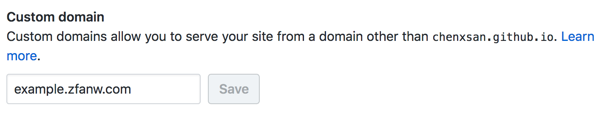

如果你需要存放网页，但没有自己的服务器，那么 Github Pages 是个不错的托管选择。

拿我的 Github 账户说，我的账户名是 chenxsan，则 `chenxsan.github.io` 是 Github 保留给我的域名：

1. 创建一个名称为 `chenxsan.github.io` 的仓库，
2. 推送本地文件到仓库，
3. 开启仓库设置中的 GitHub Pages，
4. 访问 `chenxsan.github.io` - 服务器、域名的费用都省了。

不过我决定给它自定义一个域名，比如 `example.zfanw.com`。

## 设置自定义域名

首先我们需要在仓库的设置里填入自定义域名，如下图：



此时访问 example.zfanw.com，浏览器会提示：

```
example.zfanw.com’s server IP address could not be found.
```

IP 地址未找到 - 因为我们还没做任何 DNS 解析的工作。

## 绑定 CNAME

一般情况下，我们是添加 A 记录将域名指向 IP。但 Github Pages 是通过 [`CNAME`](https://en.wikipedia.org/wiki/CNAME_record) 绑定的 - CNAME 指 Canonical Name record，其实就是域名的别名。

在 DNS 管理中添加一条 `CNAME` 记录，将 `example` 子域名指向 `chenxsan.github.io`，随后用 `dig` 命令来查看 DNS 解析情况：

```bash
$ dig example.zfanw.com +nostats +nocomments +nocmd

; <<>> DiG 9.9.7-P3 <<>> example.zfanw.com +nostats +nocomments +nocmd
;; global options: +cmd
;example.zfanw.com.             IN      A
example.zfanw.com.      3599    IN      CNAME   chenxsan.github.io.
chenxsan.github.io.     3599    IN      CNAME   sni.github.map.fastly.net.
sni.github.map.fastly.net. 18   IN      A       151.101.53.147
```
成功。

就这么简单？是的，就这么简单 - 不过你如果要配置顶级域名的话，则稍稍复杂些，请查阅 [Github 文档](https://help.github.com/articles/setting-up-an-apex-domain/)。

## 不足之处

目前 Github Pages 的自定义域名不支持 https。

## 更新

2018.05.01 开始，Github Pages 自定义域名[支持 https](https://blog.github.com/2018-05-01-github-pages-custom-domains-https/)。