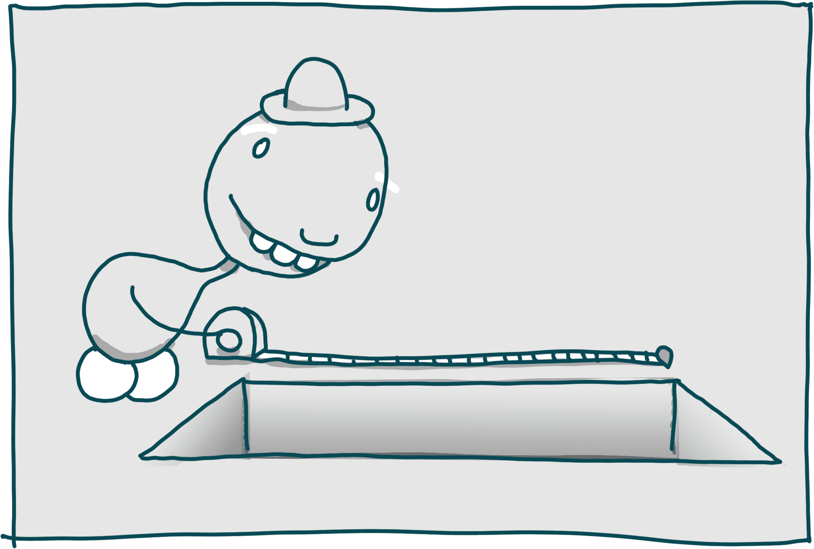
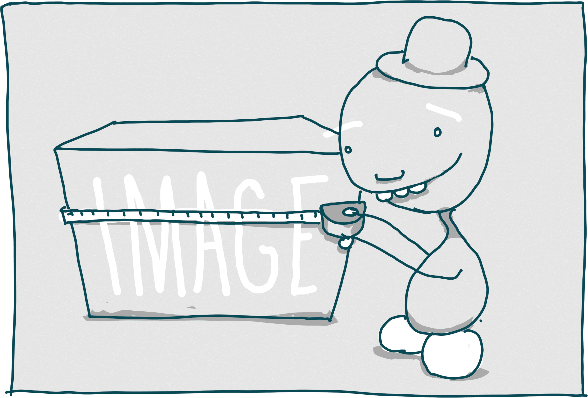
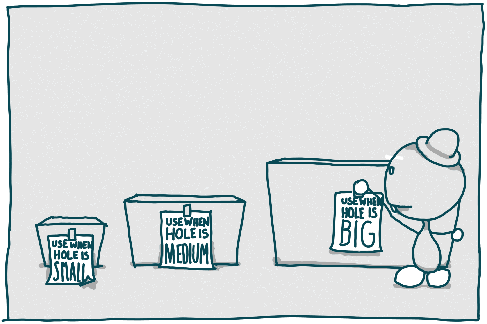
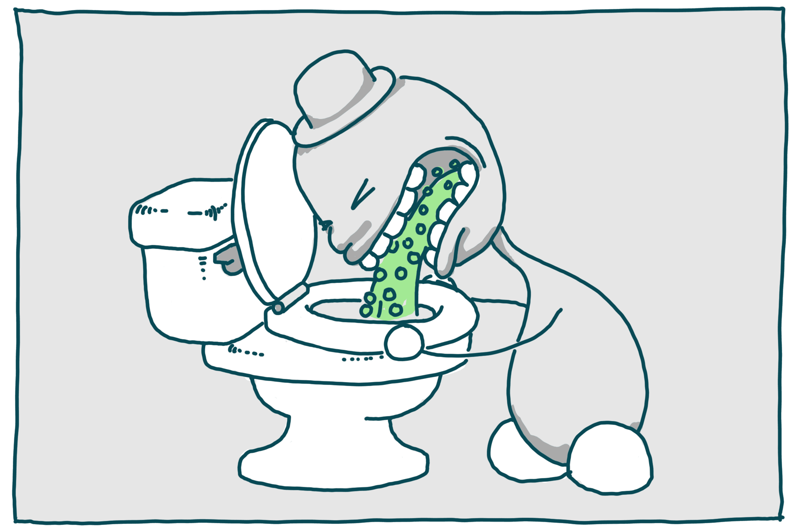

**译注**：本文译自 [Srcset and sizes](http://ericportis.com/posts/2014/srcset-sizes/)，原文使用 [CC BY 3.0](http://creativecommons.org/licenses/by/3.0/) 许可。感谢作者额外提供一套灰色背景图片。

## 第一部分：媒体查询有什么问题？

且说你是在 [1993.2.23](http://1997.webhistory.org/www.lists/www-talk.1993q1/0182.html) 到 [2010.5.25](http://alistapart.com/article/responsive-web-design/) 期间制作网页。图片真是太简单了！无非就是：

* 看看你的定宽布局
* 量一量，要塞入你手上这张图片，究竟每个用户屏幕上固定需要多少个像素
* 打开 Photoshop
* 根据量好的尺寸保存图片
* 在 `` 标签中引用
* 给自己倒一杯啤酒(或是打开一罐豌豆罐头)，庆祝任务完成






在偶尔会有一些先知从荒原里走出，吐露[真相](http://alistapart.com/article/dao/)，指出这个方法与生俱来的问题以前，这个方法已经服侍普通的 Web 设计者们二十年了。

只是，时代正在改变。

四年前，Ethan Marcotte 发表了一篇[文章](http://alistapart.com/article/responsive-web-design/)；13 天后，Steve Jobs 发布一台[手机](http://en.wikipedia.org/wiki/IPhone_4)；突然之间，[弹性](http://unstoppablerobotninja.com/entry/fluid-images)和/或[高清屏](http://en.wikipedia.org/wiki/Retina_Display)图片就成形了。随后，各种[咬牙切齿](https://www.google.com/search?q=site:lists.whatwg.org+responsive+images)。

<video style="max-width: 100%;" controls="controls"><source type="video/mp4" src="./oops-720.mp4"> <source type="video/ogg" src="./oops-720.ogv"> 您的浏览器不支持 `video`，请下载后用播放器打开。</video> 

碰上响应式图片，我们的第一直觉，是试试我们在响应式布局上用到的工具：媒体查询。



浏览器无法知道它尚未加载的网站的一切。但它们对自身的渲染环境却总是了解：视口的尺寸，用户屏幕的分辨率，等等。媒体查询的思路是这样的：让 web 开发者根据特定环境做特定的事情。如果视口宽于 1000 像素，那么侧边栏就显示在左边。否则，将它推到主栏下方。如果用户的屏幕是高清屏，那就使用一张大图，否则使用小图。

太简单啦。


但不幸的是，响应式图片的情况里，使用媒体查询通常是非常[糟糕](http://www.xanthir.com/b4Su0)的。


这值得花些时间解释。基于媒体查询的响应式图片选择之所以糟糕，是因为大部分响应式设计者是基于一个变量（视口宽度）来决定如何改变页面布局的，而对于响应式图片，我们实际上需要关心三个变量：

* 布局中图片的渲染尺寸（CSS 像素尺寸）
* 像素密度
* 我们手头可支配的不同尺寸的图片

…这些被微妙地简缩成媒体查询。

一旦我们知道这三种东西，那么解法就简单了。从给定的资源里，挑出一张最小的，但是尺寸又要比`渲染尺寸` * `像素密度` 大。

但是，很不幸，要确定`渲染尺寸`是一件非常困难的事。Web 开发者没法知道它。弹性图片会伸缩；在响应式布局中，一张图片的`渲染尺寸`什么可能性都有。还有一点可能也让人吃惊，就是浏览器在加载图片时，也不知道`渲染尺寸` – `渲染尺寸`依赖于页面 CSS，通常浏览器是在页面开始加载图片后很久才分析 CSS 的。

运气好的是（看起来如此），给我们的源文件附加媒体查询可以绕过这问题，只是要把`渲染尺寸`分成两个：

* 视口尺寸
* 相对于视口，图片大小将如何变化

…当然，还需要作者在完成<del>一些</del>许多<del>简单</del>复杂的计算后指定视口尺寸与像素密度。

怎样的计算呢？让我们看一个例子。


（请注意，虽说我会尽量简化，但这个例子存在的理由，只是想告诉你，亲爱的读者们，基于媒体查询的计算过程是繁杂且易出错的。如果你很快就确认了这一点，请跳到第二部分。）

假定你有一张图片的三个版本：

* `large.jpg` (1024 x 768)
* `medium.jpg` (640 x 480)
* `small.jpg` (320 x 240)

然后在弹性网格 – 一种开始只一列，大视口中切换成三列的网格，比如[这样](http://ericportis.com/assets/2014-03-24-srcset-sizes/wolves/)，你想要挑选一张图片并加载它。

你想要支持 1x 和 2x 的`设备像素比`。

怎样构造媒体查询？让我们从上开始。

`large.jpg` 只有在绝对必要 – `small.jpg` 和 `medium.jpg` 都太小的时候才加载。更确切说，我们只需要如下情况加载 `large.jpg`：

```
    渲染尺寸 x 像素密度 > 尺寸仅次于它的文件长度
```

我们的示例布局里，`渲染尺寸`只是`视口尺寸`的一个简单百分比。因此：

```
    渲染尺寸 = 图片相对视口的比例 x 视口尺寸
```

`尺寸仅次于它的文件`是 `medium.jpg`，所以：

```
    尺寸仅次于它的文件长度 = 640px
```

汇合一下，则我们得到以下的不等式：

```
    图片相对视口的比例 x
    视口尺寸 x
    像素密度
    > 640px
```

重排一下：

```
    视口尺寸 >
      640px ÷
      (图片相对视口的比例 x 像素密度)
```
要构建媒体查询，我们需要求解每个可能的`图片相对视口的比例`和`像素密度`值下的`视口尺寸`。

`图片相对视口的比例`有两个可能取值：到达断点(36em)前的 100[vw](http://www.w3.org/TR/css3-values/#viewport-relative-lengths)及到达断点后的 33.3vw。

至于`像素密度`…呃，[取值可能无数](http://en.wikipedia.org/wiki/List_of_displays_by_pixel_density)，不过我们前面已经说过，只要支持`设备像素比` 1x 和 2x。

两种`图片相对视口的比例` x 两种`设备像素比` = 四种需要我们考虑的情形。且一个一个地来看。

### 1x，断点前

因为我们的断点是 36em，所以很明显地：

```
    视口尺寸 < 36em
```
把`图片相对视口的比例` = 100vw 和`像素密度` = 1x 代入我们此前的不等式中：

```
    视口尺寸 >
      640px ÷ ( 100vw x 1x ) = 640px = 40em
```
结合两个不等式，我们得到一个不可能的东西：

```
    36em > 视口尺寸 > 40em
```

所以我们可以不用考虑这种情况 – 即单列布局下，1x 的设备像素比不需要 `large.jpg`。

### 2x，断点前

再来：
```
    视口尺寸 < 36em
```
但这回我们代入 2x：
```
    视口尺寸 >
      640px ÷ ( 100vw x 2x ) = 320px = 20em
```
结合起来我们得到：
```
    36em > 视口尺寸 > 20em
```
于是视口尺寸在这个范围中时，2x 屏幕上我们要加载 `large.jpg`。

### 1x，断点后

现在我们要比断点宽了：
```
    视口尺寸 > 36em
```
而且我们是在 1x 屏幕上的三列布局：
```
    视口尺寸 >
      640px ÷ ( 33.3vw × 1x ) = 1920px = 120em
```
当视口大于 120em 时，它始终是大于 36em的，因此我们可以把 36em 丢掉不管。在 1x 屏幕上，我们要加载 `large.jpg`的条件：
```
    视口尺寸 > 120em
```
Ok，最后一个。

### 2x，断点后
```
    视口尺寸 > 36em
```
…而且…
```
    视口尺寸 >
      640px ÷ ( 33.3vw × 2x ) = 960px = 60em
```
…结论是，以下情况下在 2x 屏幕加载 `large.jpg`：
```
    视口尺寸 > 60em
```
把所有的组合一起放入媒体查询：
```html
    ( (min-device-pixel-ratio: 1.5) and (min-width: 20.001em) and (max-width: 35.999em) ) or
    ( (max-device-pixel-ratio: 1.5) and (min-width: 120.001em) ) or
    ( (min-device-pixel-ratio: 1.5) and (min-width: 60.001em) )
```
`medium.jpg` 的计算过程就留给读者做练习。

使用最初的 `<picture>` 提案来标记我们的图片，结果是：
```html
    <picture>

      <source src="large.jpg"
              media="( (min-device-pixel-ratio: 1.5) and (min-width: 20.001em) and (max-width: 35.999em) ) or
                     ( (max-device-pixel-ratio: 1.5) and (min-width: 120.001em) ) or
                     ( (min-device-pixel-ratio: 1.5) and (min-width: 60.001em) )" />
      <source src="medium.jpg"
              media="( (max-device-pixel-ratio: 1.5) and (min-width: 20.001em) and (max-width: 35.999em) ) or
                     ( (max-device-pixel-ratio: 1.5) and (min-width: 60.001em) ) or
                     ( (min-device-pixel-ratio: 1.5) and (min-width: 10.001em) )" />
      <source src="small.jpg" />

      <!-- fallback -->
      

    </picture>
```
让人头痛！

另外，有一堆的标记不支持超过 2 的`设备像素比`，或是低于 1 的`设备像素比`，通常是不完美地支持这两者间的数值。如果我们要扩展`设备像素比`的支持，则要考虑的情景数量就会陡增。

关于标记最糟糕的部分是，如果我们改变任何一个基础变量 – 源图片的尺寸，要支持的设备分辨率… 或者影响图片尺寸的布局的任一方面 – 我们需要重新做过所有的算术。



快，还是早点跳到第二部分吧！

## 第二部分：`srcset` + `sizes` = 太棒了！

那么，如果媒体查询不是正确的工具的话，现在怎么办？

让我们先回到响应式图片的几个基本变量上，这一次，考虑下它们什么时候变，以及谁知道了什么。

| 变量               | 作者在写代码时是否清楚？ | 浏览器加载页面时是否清楚？ |
|--------------------|--------------------------|----------------------------|
| 视口尺寸           | no                       | yes                        |
| 图片相对视口的比例 | yes                      | no                         |
| 像素密度           | no                       | yes                        |
| 源文件尺寸         | yes                      | no                         |

注意了！一列 yes 时，另一列总是 no：作者与浏览器所了解的不一样，它们是互补的。我们是钥匙主人，它们是看门人；把我们的力量结合起来，如此，如此。

怎样联合起来？

媒体查询就像一套紧急预案，“你看，”我们跟浏览器说，“我不清楚视口会有多大，但如果有这么大，那就用这个文件。如果还要大，用那个。如果屏幕是高清屏，那也用那个，但如果我切换到三列布局，那还是不要用那个…”我们是在给杂七八可能的文件贴标签，根据浏览器知道而我们写代码的无法知道的理由。

如我们所见的，实际上，这有太多工作要做。

那么，如果我们反过来呢？

譬如不再提供给浏览器一些乱七八糟的预案，只是告诉它它所不知道的东西？也就是说，图片相对于视口将怎样变换大小，以及源文件的尺寸。如果我们有办法把这些知识分享给浏览器，那选择源的条件不都就有了吗？

是的！实际上，这也是[最新的 &lt;picture&gt; 细则中](//picture.responsiveimages.org/) `size` 属性和 `srcset` 中的 `w` 描述符所做的事。再来看一张表：

| 变量               | 作者在写代码时是否清楚？ | 浏览器加载页面时是否清楚？      |
|--------------------|--------------------------|---------------------------------|
| 视口尺寸           | no                       | yes                             |
| 图片相对视口的比例 | yes                      | <s>no</s>yes! 通过 \`size\`！   |
| 像素密度           | no                       | yes                             |
| 源文件尺寸         | yes                      | <s>no</s>yes! 通过 \`srcset\`！ |


在我们深入以前，且先搞明白三件事。

第一个，也是最重要的，目前(译注：原文写于 2014.3.24，译文的时间里 Chrome 34、Firefox 33 中已经实现)没有一个浏览器实现了它们，但前景看起来很不错，只是规范还没稳定。因此且慢使用。现在不能用，未来也只会出问题。

第二：曾经有一个叫 [`srcset`](http://lists.whatwg.org/htdig.cgi/whatwg-whatwg.org/2012-May/035855.html) 的响应式图片提案。我们要讲的全新提案依赖的属性也叫 `srcset`。新旧 `srcset` 均在逗号分隔的资源 URLS 列表中使用 `w` 描述符，但新旧 `w` 所代表的意思完全不一样！旧的 `w` 是媒体查询的简写形式：它描述的宽度是指视口宽度。新 `w` 则表示文件的宽度。我们随后就会详细解释新的 `w`，但现在，且让我掏出《黑衣人》中的记忆消除棒，消除掉你所有关于 `srcset` 和 `w` 的知识。


都忘了？很好。

第三点：如果你一路看下来，对之前的 `<picture>` 细则燃起过希望的话，那么你要知道，新的 `<picture>` 细则中，仍然允许你使用媒体查询切换源，也可以附加分辨率描述符给源 URLs。如果你是在做[艺术指导](http://usecases.responsiveimages.org/#art-direction)或是[固定大小的分辨率切换](http://usecases.responsiveimages.org/#device-pixel-ratio-based-selection)，那你绝对应该使用这些特性。但如果你只是想让你的图片伸缩，则别有新工具可用。

Okay。我想我已经扫清障碍，做好准备。让我们处理下我们的[案例](http://ericportis.com/assets/2014-03-24-srcset-sizes/wolves/)，这次使用 `srcset` 和 `size`。

回顾一下，我们的图片有三个版本：

* `large.jpg` (1024 x 768)
* `medium.jpg` (640 x 480)
* `small.jpg` (320 x 240)

还有一个 36em 的断点位置，我们的布局从一列切换到三列。

下面是标记：

```html
    
```
你可能注意到，虽然这段标记取自 [`picture` 细则](http://picture.responsiveimages.org/)，但我们却没见到 `picture` 元素。`srcset` 和 `size` 属性是应用到 `` 的，对于类似这个的简单的非艺术指导，非类型切换的案例，你可以也应该使用我们的老朋友 `` 的实例来标记你的响应式图片。

一样的旧 ``，全新的属性；让我们一个个看过去。
```html
    src="small.jpg"
```
这个一点都不新鲜嘛。正是我们的回落(fallback) `src`，功能照旧，在浏览器不识 `srcset` & `size` 的时候加载该图片。

下一个！
```html
    srcset="large.jpg 1024w,
            medium.jpg 640w,
            small.jpg 320w"
```
这个也是不说自明的。`srcset` 接受一个逗号分隔的 URLs 列表，指向当前图片的所有版本；每个图片的宽度由 `w` 描述符确定。因此，如果你”保存为 Web…“时图片为 1024×768，那么就在 `srcset` 中将其标记为 `1024w`。简单。


你可能注意到，这里我们只指定了宽度。为什么不一起指定高度？我们的布局中，图片是由宽度限定的，它们的宽度通常由 CSS 明确指定，但高度不是。大部分的响应式图片也是由宽度限定的，因此细则中为了简单就只处理宽度。

展望未来，我们有[理](https://github.com/ResponsiveImagesCG/picture-element/issues/85)[由](https://github.com/ResponsiveImagesCG/picture-element/issues/86)(我看来，非常棒的理由)使用 `h` 描述符来描述文件的高度，只是，还不到时候。

让我再强调一遍，你可以在 `srcset` 源中使用 `1x`/`2x` 这样的分辨率描述符替换 `w` 描述符，但不要在 `srcset` 中混合使用它们。真的。


Okay，这就是 `srcset` 和 `w` 了。

最后，浏览器在知道如何选择一个源文件前还需要知道图片在布局中的渲染尺寸。对于这个，我们有 `sizes`。从例子中看：
```html
    sizes="(min-width: 36em) 33.3vw,
           100vw"
```
格式是这样的：
```html
    sizes="[media query] [length], [media query] [length] ... etc"
```
我们让媒体查询与长度成对出现。浏览器检查每个媒体查询，直到碰上匹配的，就使用配对的那个长度作为源文件选择难题的最后一个因素：图片相对于视口的渲染比例。

“那是什么？”你说，“媒体查询？我以为你说过它们非常糟糕？！”

我确实说过，在选择源上，它们是非常糟糕的一种机制。但这里媒体查询所做的并不一样，它们只是让浏览器提前一点(也是非常关键的)时间知道它将要在页面 CSS 碰到的断点情况。记不记得，我们第一个例子中的各种查询，根本与页面的唯一断点(36em)毫无关系？我是说，60em，20em，10em – 它们到处都是。`sizes` 中的断点必须准确反应你的页面断点。媒体查询后的长度表示的是，媒体查询判断为真时，图片在布局中的长度。

于是，浏览器就有了所有必要的信息，来做第一部分中我们这又拖、又懒、还易出错的人类需要做的那种种计算。于是我们就得以轻松，然后如上帝所愿去吃豆子。

而且！还记得不我们的媒体查询示例只覆盖 1x & 2x 的屏幕？这个标记却可以在任何`设备像素比`上使用。不用再猜测它可能或不太可能支持哪些分辨率了。2016 年 4.8625x 的智能手表出来时，`srcset` & `sizes` 也已覆盖。

再者！这个办法也给了浏览器一些空间。指定给源的媒体查询或为真或为假，如果为真，则浏览器必须加载相应的源文件。`sizes` 和 `srcset` 没那么死板。规范允许浏览器当带宽或慢或贵的时候加载较小的源文件。

“嗯，所有这些无疑地听起来很棒，”你说，缓缓地点着头，开始理解描述性的而非条件方法的好处。“可是等等，什么是长度？”

[长度可以千奇百怪！](http://www.w3.org/TR/css3-values/#lengths)一个长度可以是绝对的（比如 `99px`，`16em`）或是相对的（`33.3vw`，就像我们的例子中）。你可能会注意到，不跟我们的例子一样，许多布局会结合使用绝对和相对单位。这也是[意外地支持性特别好](http://caniuse.com/calc)的 [calc() 函数](http://dev.w3.org/csswg/css-values/#calc-notation)的用处。比如说我要给我们的[三列布局增加一 12em 的侧边栏](http://ericportis.com/assets/2014-03-24-srcset-sizes/wolves/wolfroll.html)。我们这样调整我们的 sizes 属性：
```html
    sizes="(min-width: 36em) calc(.333 * (100vw - 12em)),
           100vw"
```
好了！

“Okay，okay，”你深思着说，摸了摸下巴，对这知识的涌入感到疲倦（也觉得激动）。“最后还有一件事：那个孤零零的 `100vw` 是什么？你是不是忘了媒体查询？

在规范里，没有和媒体查询一同出现的长度是一个”默认长度“。如果没有匹配到哪个媒体查询，就使用默认的。这意味着，一张巨大的全宽横幅图片，你的标记可以如下简单：
```html
    
```
简单。

