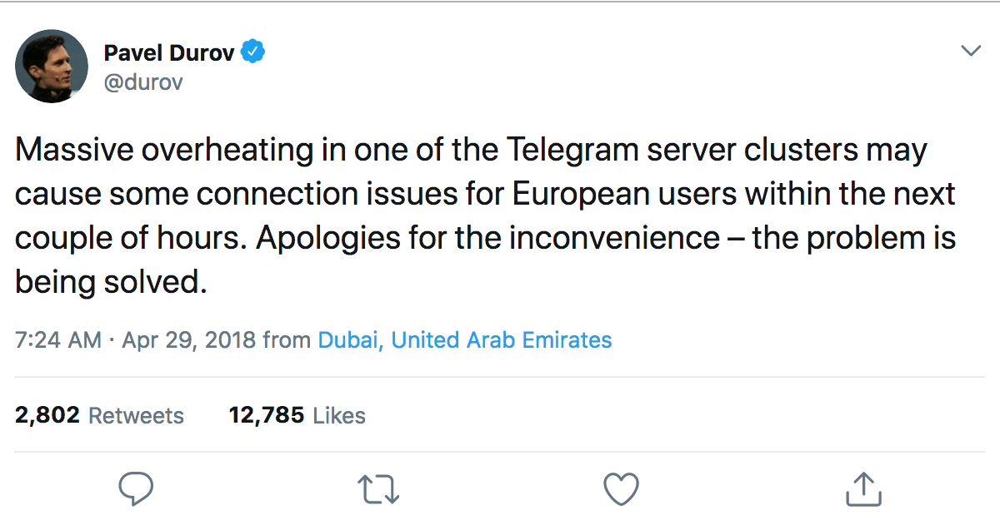
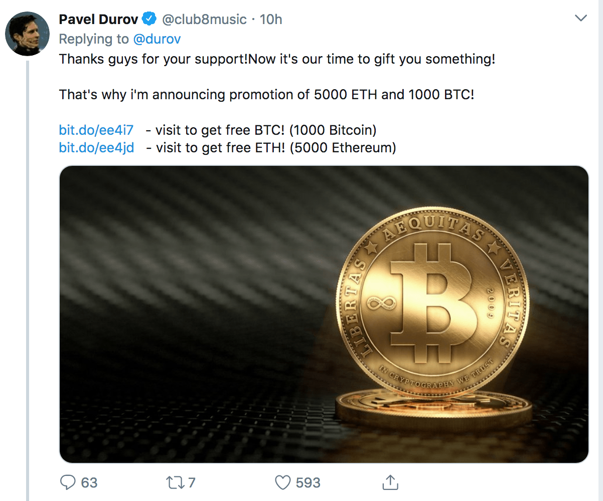
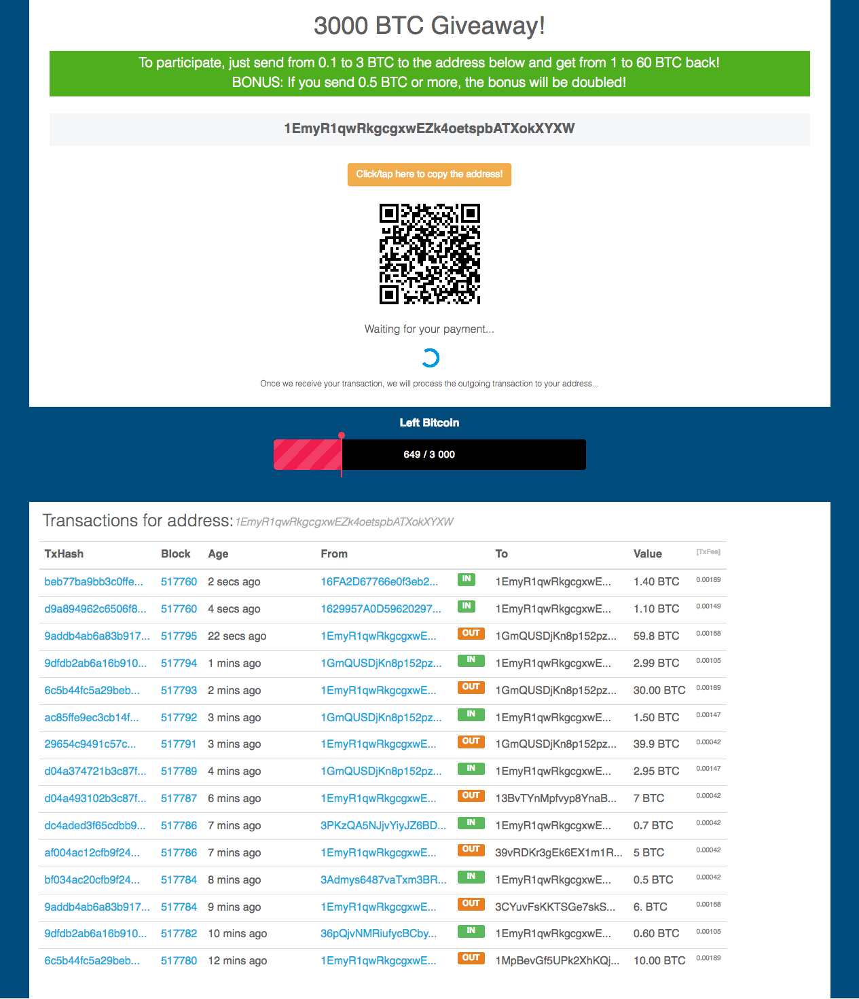
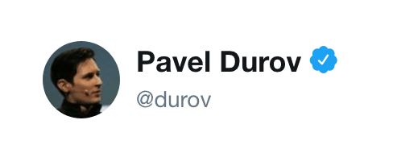
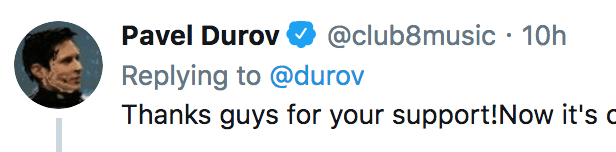
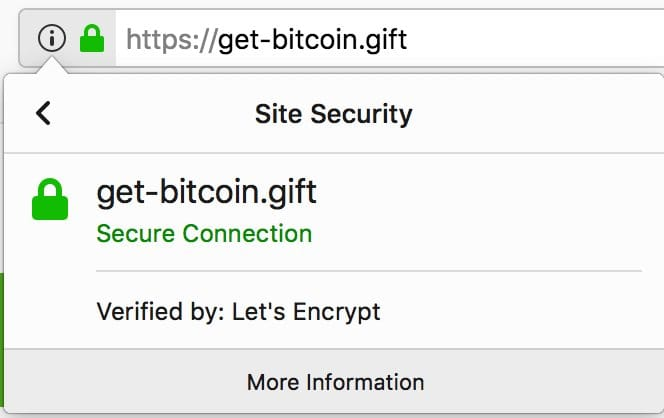
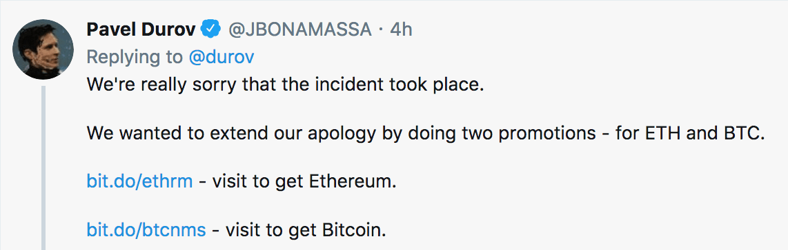
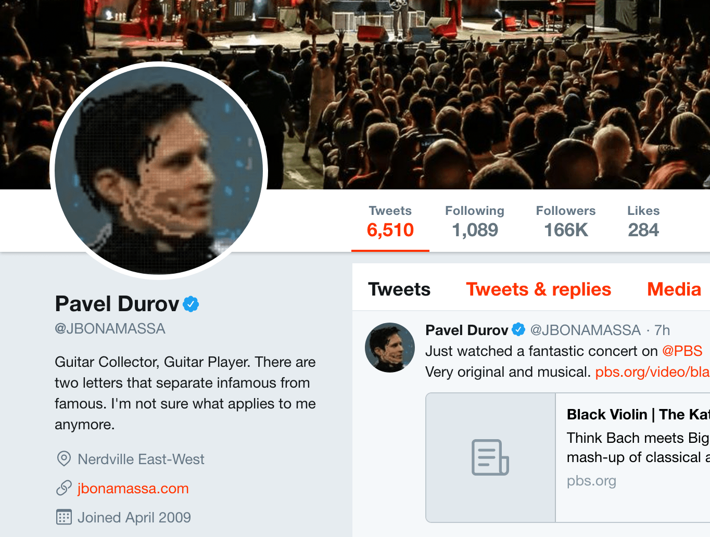
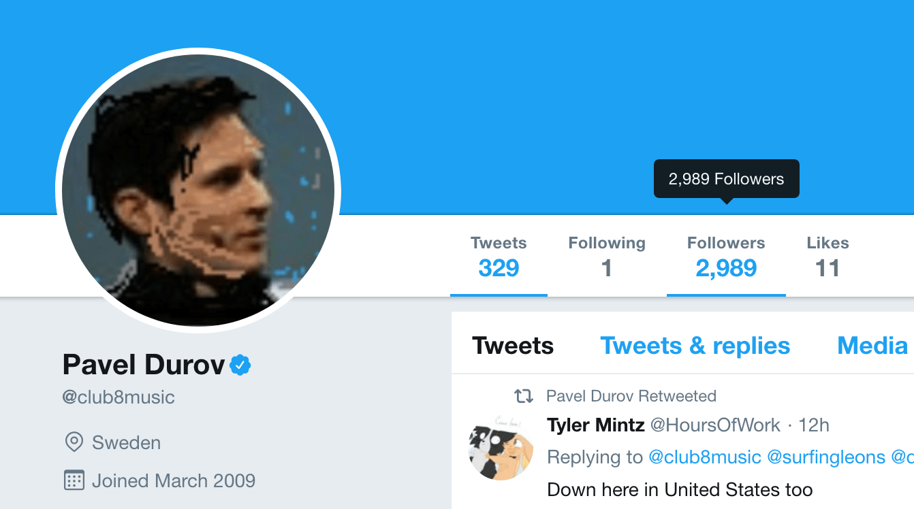

大概在中午或更早，我发现我的 [telegram 发推机器人](https://t.me/tweet_for_me_bot)停止运转。稍稍查了下，有人说是 telegram bot api 服务挂了，心想应该很快能恢复，就没放心上。但直到傍晚服务都还没恢复，就上 twitter 看看 telegram 创始人 durov 的消息：

毫无意外，我穷苦的眼神一下就看到底下第一条金光闪闪的回复：

Wow，我马上点了比特币链接过去：

> To participate, just send from 0.1 to 3 BTC to the address below and get from 1 to 60 BTC back!
> BONUS: If you send 0.5 BTC or more, the bonus will be doubled!

翻译过来差不多就是：买 0.1 - 3 比特币送 1 - 60 比特币。

有这种好事？我不相信，可能是钓鱼。于是我又回到 twitter，看了一眼账户。

**闪亮的 twitter 认证账户，一模一样的用户昵称及头像。**

毫无疑问，不是钓鱼。

随后我转推了。心里在想，可惜，我就差 0.1 比特币。

但随后我又想到一种可能：万一 telegram 创始人的 twitter 账户被人黑了，那就惨了 - 要知道 3000 比特币时价大概在 $27,902,564,25。这手笔大得吓坏我。

于是我往下翻看回复，看到有人说 Scam 的字眼 - 不巧我的英文词汇里有这个单词，我就又认真对比两个账户：

我终于看到 **FAKE** 四个大写字母。

一个是 durov，一个是 club8music - 但都是灰色的，融入了其它内容中，导致我根本没有注意到。

赶紧删掉转推。所幸我的关注者不多，炒币的估计更少，应该不至于有人上当了要来砍我几刀。

这是我第一次如此近距离体验网络钓鱼，我得说，非常刺激。

钓鱼者非常聪明，给钓鱼用的 twitter 账户搞了认证 - 这是我上当的第一步，并且换上 durov 一样的昵称、头像，然后在 durov 的推文下发钓鱼推，另外还搞了不少僵尸账户来收藏、转推该推文，这也是为什么钓鱼推文显示在 durov 的回复列表第一条。

当然，钓鱼网站还有 https 证书呢 - 这是我上当的第二步。只不过，用的是 Let's Encrypt 的免费证书 - 这是我醒悟后去查看的：

除了上面的 club8music 账户外，我还发现另外一个认证账户 JBONAMASSA 参与钓鱼：

是 twitter 的用户认证系统有问题？还是认证过的 twitter 账户被人侵入？

上面这个账户是 2009 年加入的，有 166k 关注者。更像是认证账户被人黑了然后拿来钓鱼。

另一个同样是 2009 年加入的，但关注者较少，3k 不到。

除了这两个认证账号，我还发现不少非认证账号参与钓鱼。

我得说，这次钓鱼挺成功的，但**我没有比特币**。

现在再去看那个钓鱼网站 - 数据是写死的，真是没有诚意。

## 更新

### 第一则

截止北京时间 2018-04-29 22:17，JBONAMASSA 账户似乎已恢复正常，头像使用 twitter 默认头像，但未见账号有任何被入侵的声明。

另外我查看 Archive 上的[历史快照](https://web.archive.org/web/20170918054827/https:/twitter.com/jbonamassa)，发现该账户过去使用的并非 twitter 默认头像。

### 第二则

截止北京时间 2018-04-30 08:23，club8music 账户似乎也恢复正常，同样未见任何声明。[Archive 历史快照](https://web.archive.org/web/20160816031437/https://twitter.com/club8music)显示，2016 年时该账户使用的头像并非 twitter 的默认头像。

## 结论

因为两个账号在恢复正常后，均未发布任何声明，这就让人担心，或许他们还在黑客控制中，只是潜伏着，等待下一次诈骗的机会。

## 附

1. [JBONAMASSA 被入侵的快照](https://web.archive.org/web/20180429111326/https:/twitter.com/JBONAMASSA)
2. [club8music 被入侵的快照](https://web.archive.org/web/20180429141932/https://twitter.com/club8music)